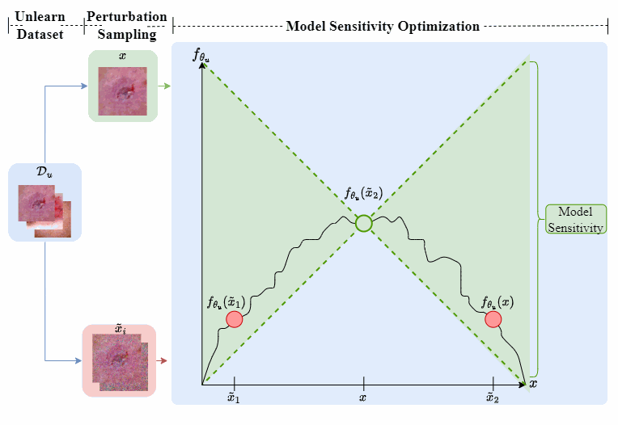

# Maverick

### Maverick: Collaboration-free Federated Unlearning for Medical Privacy

### MICCAI 2025 (Oral Presentation)

#### (Released on June 18, 2025)

## Introduction

Federated Learning (FL) enables decentralized training while preserving data privacy, critical for sensitive domains like medical imaging. Regulatory demands for the "right to be forgotten" have driven interest in Federated Unlearning (FU), but existing methods require all clients' participation, posing challenges in privacy, efficiency, and practicability. 

<p align="center"> 
<p align="center"> Figure 1: Overview of our proposed Maverick framework. </p>

We introduce Maverick, a novel FU framework that performs unlearning locally at the target client, eliminating the need for other clients’ involvement. Leveraging Lipschitz continuity, Maverick reduces model sensitivity to unlearned data, ensuring privacy, lowering computational costs, and preserving performance. 

<p align="center">
  
</p>
<p align="center">Figure 2: Model sensitivity optimization visualization.</p>

## Getting started

### Environment Preparation

Before executing the project code, please prepare the Python environment according to the `requirement.txt` file. We set up the environment with `python 3.9.12` and `torch 2.0.0`. 

```python
pip install -r requirement.txt
```

### Dataset Preparation
Install [MedMnist](https://github.com/MedMNIST/MedMNIST) dataset:

```python
pip install medmnist
```

Or install from source:

```python
pip install --upgrade git+https://github.com/MedMNIST/MedMNIST.git
```

## Citation

```bibtex
@InProceedings{Ong_Maverick_MICCAI2025,
        author = { Ong, Win Kent and Chan, Chee Seng},
        title = { { Maverick: Collaboration-free Federated Unlearning for Medical Privacy } },
        booktitle = {proceedings of Medical Image Computing and Computer Assisted Intervention -- MICCAI 2025},
        year = {2025},
        publisher = {Springer Nature Switzerland},
        volume = {LNCS 15973},
        month = {September},
        page = {367 -- 377}
}
```

## Feedback
Suggestions and opinions on this work (both positive and negative) are greatly welcomed. Please contact the author by sending an email to
`winkent.ong at um.edu.my` or `cs.chan at um.edu.my`

# License and Copyright

The project is open source under BSD-3 license (see the `LICENSE` file).

©2025 Universiti Malaya.
"# MaverickPrivate" 
"# Maverick" 
